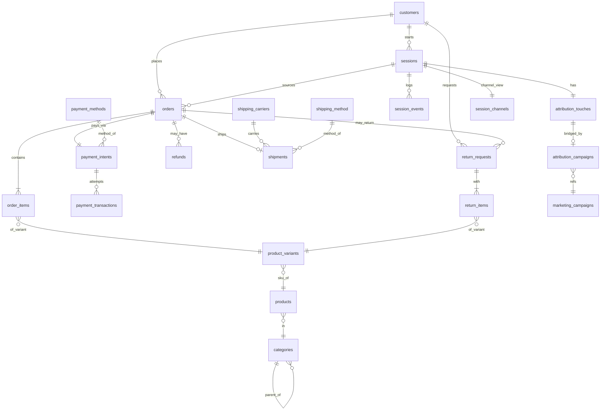

# `ecom` Schema Dictionary

*Owner: Sidharth Menon · Built from full-table CSV exports · Data window: **Mar 16 – Jun 14, 2026** (a few child tables trail to late June).*
*Working reference for the SQL program — extended each week. Money columns are numeric in the database; the CSV exports render them with comma thousand-separators (e.g. `1,899`), so strip commas on load.*

---

## A. Table Inventory

| Table | Approx rows | What it stores | Grain |
|---|---|---|---|
| `orders` | 40,000 | Every order placed, with money, status, and payment outcome | One row per order |
| `order_items` | 81,806 | Line items within orders | One row per (order, variant) line |
| `customers` | 10,000 | Customer master with demographics + acquisition attributes | One row per customer |
| `products` | 4,000 | Product catalogue | One row per product |
| `product_variants` | 12,090 | Sellable variants (colour/size/SKU) of a product | One row per variant |
| `categories` | 18 | Product category tree (self-referencing) | One row per category |
| `sessions` | 100,000 | Web/app sessions, incl. anonymous | One row per session |
| `session_events` | 292,903 | Instrumented behavioural event stream (from 2026-04-19) | One row per event |
| `session_channels` | 100,000 | **View** — first-touch channel per session | One row per session |
| `attribution_touches` | 100,000 | Marketing touch (UTM) per session | One row per touch (1:1 w/ session here) |
| `attribution_campaigns` | 38,405 | **Bridge** — touch → marketing campaign, with ad cost | One row per attributed touch |
| `marketing_campaigns` | 100 | Campaign master with budget and run dates | One row per campaign |
| `payment_intents` | 40,000 | Payment attempt per order (method + outcome) | One row per order (1:1) |
| `payment_methods` | 5 | Payment-method lookup | One row per method |
| `payment_transactions` | 40,034 | Gateway transaction attempts (incl. retries + errors) | One row per transaction |
| `refunds` | 260 | Refund history | One row per refund |
| `return_requests` | 1,603 | Return requests (RMA header) | One row per return request |
| `return_items` | 2,004 | Items within a return | One row per returned line |
| `shipments` | 32,089 | Shipment per order (carrier, method, dates) | One row per order shipped (1:1) |
| `shipping_carriers` | 3 | Carrier lookup | One row per carrier |
| `shipping_method` | 3 | Shipping-method lookup (note: table name is singular) | One row per method |

> The full `ecom` schema also contains additional feature tables not exported here (per the Task 1 brief: `loyalty_accounts`, `loyalty_transactions`, `inventory_items`, `inventory_movements`, `product_reviews`, `notifications`, `customer_segments`, `segment_memberships`, `product_images`, plus intentionally-empty `collections`, `collection_products`, `consents`). Inventory them when a task needs them. **Always `select count(*)` before assuming a table has data.**

---

## B. Per-Column Notes

### `orders` (40,000)
- `order_id` — **PK**. Joins to `order_items`, `payment_intents`, `refunds`, `return_requests`, `shipments`.
- `order_number` — text business key, `ORD-1000000` format, unique.
- `created_at` — order placement timestamp (UTC). Range 2026-03-16 → 2026-06-14.
- `customer_id` — **FK → customers**. 8,800 distinct buyers (of 10,000 customers).
- `session_id` — **FK → sessions**. 80 rows null (order not tied to a tracked session).
- `cart_id` — UUID, unique per order.
- `price_list_id` — 1 (36,794) or 2 (3,206). Pricing tier.
- `status` — **fulfilment state**. Raw values are mixed-case: `delivered` (19,779) + `DELIVERED` (200), `shipped` (7,715) + `SHIPPED` (248) + `Shipped` (150), `paid` (3,946), `packed` (3,887), `cancelled` (2,178), `placed` (1,897). **Lowercase before grouping.**
- `subtotal` — numeric, pre-tax item total.
- `discount` — numeric, **always 0** (dead column; real discounts sit in coupon/promo IDs).
- `tax` — numeric.
- `shipping_fee` — 0 (33,616), 9 (3,206), or 59 (3,178).
- `total` — numeric, the headline order value (tax incl.). Used as revenue.
- `payment_status` — **did it convert**: `paid` (37,822) / `failed` (2,178). Distinct from `status`.
- `shipping_address_id` — FK, 47% null.
- `billing_address_id` — FK, 75% null.
- `applied_coupon_id` — FK (1–50), 77% null.
- `applied_promo_id` — FK (1–20), 82% null.

### `order_items` (81,806)
- No surrogate PK — grain is (`order_id`, `variant_id`).
- `order_id` — **FK → orders**.
- `variant_id` — **FK → product_variants** (references variant, not product).
- `qty` — 1–4 (75% are 1).
- `unit_price` — numeric, per-unit price.
- `line_discount` — numeric, **always 0** (dead column).
- `line_total` — numeric = qty × unit_price. Reconcile to `orders.subtotal` per order.

### `customers` (10,000)
- `customer_id` — **PK**.
- `created_at` — account creation (UTC). *Note: some customers' first order predates this — use first-order month, not `created_at`, for cohorts (see §E).*
- `first_name` / `last_name` — text. **Watch leading/trailing whitespace and HTML entities** (`&amp;`) → `trim()`/`replace()` before grouping.
- `dob` — date. **Sentinels present: `1900-01-01` (unknown) and `2099-12-31` (form max).** Filter to a realistic range before any age calc.
- `gender` — `male` (4,824) / `female` (4,736) / `other` (227) / null (213, 2%).
- `primary_email` — text (9,991 distinct).
- `primary_phone` — numeric.
- `country` — `India` (7,641) / `United States` (1,359) / **null (1,000, 10%)**. Treat null as missing.
- `state` — 31 distinct. `city` — 48 distinct.
- `is_email_verified` — bool, 85% true. `is_phone_verified` — bool, 70% true. `marketing_opt_in` — bool, 55% true.
- `lifecycle_stage` — `active` (4,869) / `at_risk` (3,903) / `new` (1,200) / `churned` (28).
- `acquisition_channel` — `organic` (4,023) / `paid` (3,490) / `referral` (1,192) / `email` (708) / `affiliate` (587).
- `source`, `utm_campaign`, `utm_medium`, `utm_source` — signup-attribution text fields (7/6/6/7 distinct values respectively).

### `products` (4,000)
- `product_id` — **PK**.
- `created_at` — catalogue add timestamp.
- `product_name` — text, unique.
- `brand_id` — 1–120 (brand table not exported).
- `category_id` — **FK → categories**. Only 14 (leaf) categories are actually used.
- `description` — text (synthetic filler).
- `is_active` — bool, 97% true.

### `product_variants` (12,090)
- `variant_id` — **PK**.
- `product_id` — **FK → products**.
- `sku` — text, unique, `SKU-00004-0000010` format.
- `color` — 8 values (Pink, Grey, Blue, Beige, White, Green, Red, Black).
- `size` — **74% null** (electronics have no size); apparel `S`–`XXL`, shoes `UK 6`–`UK 12`.
- `attributes` — JSON text (e.g. `{"fit": "regular", "material": "poly"}`).
- `is_active` — bool, 98% true.

### `categories` (18)
- `category_id` — **PK**.
- `category_name` — Apparel, Tops, Jeans, Shoes, Jackets, Electronics, Headphones, Smartwatch, Speakers, Accessories, Beauty, Skincare, Makeup, Haircare, Home, Kitchen, Decor, Bedding.
- `parent_id` — **self-FK → categories**. 4 nulls = top-level parents (Apparel, Electronics, Beauty, Home). Products hang off leaf categories only.

### `sessions` (100,000)
- `session_id` — **PK** (UUID).
- `started_at` / `ended_at` — session bounds (UTC). Earliest `started_at` 2026-03-15 23:49.
- `customer_id` — **FK → customers**, **34% null** = anonymous sessions (not orphans; see §E).
- `anonymous_id` — UUID, 65% null (present for logged-out sessions).
- `device_id` — numeric.
- `ip_address` — inet text (near-unique).
- `country` — `India` (86,760) / `United States` (13,240).
- `region` — 31 distinct. `city` — 48 distinct.
- `landing_page` — 6 values (`/`, `/collection/bestsellers`, `/category/apparel`, `/category/electronics`, `/home`, `/search`).
- `referrer` — 7 values (direct, google, meta, youtube, newsletter, linkedin, affiliate_site).

### `session_events` (292,903)
- `event_id` — **PK**.
- `session_id` — **FK → sessions** (**60 orphan rows** — see §E).
- `customer_id` — FK, 17% null (anonymous events).
- `event_type` — `product_view` (158,441) / `add_to_cart` (43,120) / `begin_checkout` (19,240) / `add_address` (18,678) / `select_shipping` (18,381) / `add_payment` (18,160) / `purchase` (16,883).
- `occurred_at` — event timestamp. **Earliest = 2026-04-19** (instrumentation launch).
- `product_id` / `variant_id` — 31% null (null on non-product events).
- `quantity` / `unit_price` — 85% null (populated mainly on purchase-type events).
- `order_id` — 94% null (populated only on `purchase` events).

### `session_channels` (100,000) — VIEW
- `session_id` — **FK → sessions** (one row per session).
- `channel` — first-touch channel: `organic` (39,924) / `paid` (34,905) / `referral` (12,146) / `email` (6,995) / `affiliate` (6,030). Derived from `attribution_touches` (distribution is identical).

### `attribution_touches` (100,000)
- `touch_id` — **PK**.
- `session_id` — **FK → sessions** (1:1 in this data — 100,000 distinct).
- `touched_at` — touch timestamp.
- `utm_source` (7) / `utm_medium` (6) / `utm_campaign` (6) — marketing tags.
- `utm_term` — 33% null (skincare / sale / shoes / headphones).
- `utm_content` — 20% null (banner_b / video_1 / banner_a / carousel).
- `channel` — `organic` / `paid` / `referral` / `email` / `affiliate` (same as the view).
- `referrer` — 7 values.

### `attribution_campaigns` (38,405) — BRIDGE
- `touch_id` — **FK → attribution_touches**.
- `campaign_id` — **FK → marketing_campaigns** (`CAMP-2026-NNNN`).
- `ad_cost_attributed` — numeric (0.5–49.36) ad spend attributed to the touch.

### `marketing_campaigns` (100)
- `campaign_id` — **PK**, `CAMP-2026-NNNN`.
- `name` — text (e.g. `reactivation_v2_meta_ads`).
- `channel` — `linkedin_ads` / `affiliate` / `email` / `meta_ads` / `youtube_ads` / `influencer` / `google_ads`.
- `budget` — numeric (5,000–200,000).
- `starts_at` / `ends_at` — campaign run dates.
- `created_at` — **uniformly 2026-11-24 — a future-dated load sentinel, not real creation time** (see §E). Use `starts_at`/`ends_at` for timing.

### `payment_intents` (40,000)
- `payment_intent_id` — **PK** (1:1 with `order_id`).
- `order_id` — **FK → orders**.
- `created_at` — attempt timestamp.
- `payment_method_id` — **FK → payment_methods**: card (14,166) / upi (12,801) / cod (4,779) / wallet (4,655) / netbanking (3,599).
- `amount` — numeric (matches `orders.total`).
- `status` — `succeeded` (38,134) / `failed` (1,866).

### `payment_methods` (5)
- `payment_method_id` — **PK**.
- `method_name` — `card`, `upi`, `cod`, `wallet`, `netbanking`.

### `payment_transactions` (40,034)
- `txn_id` — **PK**.
- `payment_intent_id` — **FK → payment_intents** (40,000 distinct → ~34 retries).
- `txn_time` — transaction timestamp.
- `gateway` — `razorpay` (18,072) / `payu` (9,948) / `stripe` (7,239) / `cash` (4,775).
- `status` — `succeeded` (38,134) / `failed` (1,900).
- `error_code` — 95% null; on failures: `UPI_TIMEOUT` (443), `BANK_DECLINE` (443), `FRAUD` (427), `NETWORK` (419), `GATEWAY_TIMEOUT` (168).
- `error_message` — null unless failed (`Payment failed` or `Gateway did not respond within 30s`).

### `refunds` (260)
- `refund_id` — **PK**.
- `order_id` — **FK → orders**.
- `created_at` — refund timestamp (some trail to 2026-06-23, past the order window).
- `amount` — numeric.
- `reason` — `return_refund` (156) / `customer_request` (52) / `duplicate_charge` (26) / `fraud_chargeback` (26).
- `status` — `succeeded` (227) / `initiated` (20) / `failed` (13). **Count only `succeeded` as money out.**

### `return_requests` (1,603)
- `return_id` — **PK**.
- `order_id` — **FK → orders**. `customer_id` — **FK → customers**.
- `requested_at` — RMA timestamp.
- `status` — `requested` (416) / `received` (310) / `picked_up` (309) / `approved` (308) / `refunded` (260). The 260 `refunded` matches the refunds row count.

### `return_items` (2,004)
- `return_id` — **FK → return_requests**.
- `variant_id` — **FK → product_variants** (returns reference variants — join to products via `product_variants`).
- `qty` — 1–2.
- `reason_id` — 1–8 (reason lookup table not exported).

### `shipments` (32,089)
- `shipment_id` — **PK**.
- `order_id` — **FK → orders** (1:1; 7,911 orders never shipped — cancelled or not-yet-fulfilled).
- `carrier_id` — **FK → shipping_carriers** (near-even: Delhivery / Bluedart / EcomExpress).
- `shipping_method_id` — **FK → shipping_method** (standard / express / same_day).
- `shipped_at` — dispatch timestamp.
- `delivered_at` — delivery timestamp, **37% null = in transit** (exclude from SLA, don't treat as instant).
- `tracking_number` — text, unique.
- `status` — `delivered` (20,043) / `shipped` (12,046).

### `shipping_carriers` (3)
- `carrier_id` — **PK**. `carrier_name` — `Delhivery`, `Bluedart`, `EcomExpress`.

### `shipping_method` (3)
- `shipping_method_id` — **PK**. `method_name` — `standard` / `express` / `same_day`. `base_fee` — 59 / 129 / 199.

---

## C. Verified Relationships (orphan-checked)

Every relationship below was confirmed by a left-join orphan count (child key not found in parent). `ecom` declares **no formal foreign keys** — these are *soft* FKs verified against the data.

| Parent | Child | Join column | Cardinality | Orphans |
|---|---|---|---|---|
| orders | order_items | order_id | 1:M | 0 |
| product_variants | order_items | variant_id | 1:M | 0 |
| customers | orders | customer_id | 1:M | 0 |
| sessions | orders | session_id | 1:M (80 null) | 0 |
| products | product_variants | product_id | 1:M | 0 |
| categories | products | category_id | 1:M | 0 |
| categories | categories | parent_id | self, 1:M | 0 |
| orders | payment_intents | order_id | 1:1 | 0 |
| payment_methods | payment_intents | payment_method_id | 1:M | 0 |
| payment_intents | payment_transactions | payment_intent_id | 1:M | 0 |
| orders | refunds | order_id | 1:M | 0 |
| orders | return_requests | order_id | 1:M | 0 |
| customers | return_requests | customer_id | 1:M | 0 |
| return_requests | return_items | return_id | 1:M | 0 |
| product_variants | return_items | variant_id | 1:M | 0 |
| orders | shipments | order_id | 1:1 | 0 |
| shipping_carriers | shipments | carrier_id | 1:M | 0 |
| shipping_method | shipments | shipping_method_id | 1:M | 0 |
| customers | sessions | customer_id | 1:M (34,751 null) | 0 |
| sessions | session_events | session_id | 1:M | **60** |
| sessions | attribution_touches | session_id | 1:1 | 0 |
| sessions | session_channels | session_id | 1:1 | 0 |
| attribution_touches | attribution_campaigns | touch_id | 1:1 | 0 |
| marketing_campaigns | attribution_campaigns | campaign_id | 1:M | 0 |

*Note on ID formatting:* IDs in the CSV exports carry comma thousand-separators (`7,416`); strip them before joining.

---

## D. ER Diagram

---

## E. Things That Surprised Me

- **No declared foreign keys at all.** Every relationship in §C is a *soft* FK (naming convention only). I verified each with an orphan-count check — all clean except one (below). On a real warehouse this is normal; never assume referential integrity, prove it.
- **`orders.status` is mixed-case.** `delivered`/`DELIVERED`, `shipped`/`SHIPPED`/`Shipped` all coexist — 598 rows hide in the case variants. A naive `where status = 'shipped'` silently drops them. Always group/filter on `lower(status)`.
- **`payment_status = 'failed'` (2,178) exactly equals `status = 'cancelled'` (2,178), and every non-cancelled order is `paid`.** So paid-rate over non-cancelled orders is always 100% — compute paid/cancelled rates over **all** orders, but exclude cancelled from revenue and AOV. Apply this cancelled-handling rule consistently across all 10 queries.
- **Money columns look like text in the CSVs.** `unit_price` = `1,899`, `total` = `1,295.64` — comma thousand-separators from the export. They're numeric in the DB; strip commas / cast on load or every aggregation breaks.
- **`discount` and `line_discount` are constant 0.** Dead columns — real promo logic lives in `applied_coupon_id` / `applied_promo_id`, not here. Don't compute discount rates off them.
- **`marketing_campaigns.created_at` is uniformly `2026-11-24`** — five months *after* the data window and clearly a backfill/load sentinel, not a real creation time. Use `starts_at`/`ends_at` for campaign timing.
- **`customers.dob` carries sentinels** `1900-01-01` (legacy "unknown") and `2099-12-31` (form max). Any age math over the raw column produces nonsense — filter to a realistic birth-year range first.
- **A third of sessions are anonymous.** `sessions.customer_id` is null on 34,751 rows — these are logged-out sessions, **not orphans**. An inner join `sessions → customers` quietly drops ~35% of traffic; use a left join.
- **60 `session_events` rows reference session_ids that don't exist in `sessions`** (0.02%) — the only real orphans in the schema. Tiny, but left-join or they vanish from event aggregates.
- **Event instrumentation starts 2026-04-19**, ~34 days after orders begin (2026-03-16). Sessions before that date have zero events — they're uninstrumented, not inactive. Restrict any funnel/behaviour query to on/after the launch date.
- **`customers.country` is 10% null** (only `India`/`United States` otherwise). Treat null as missing rather than assuming a default.
